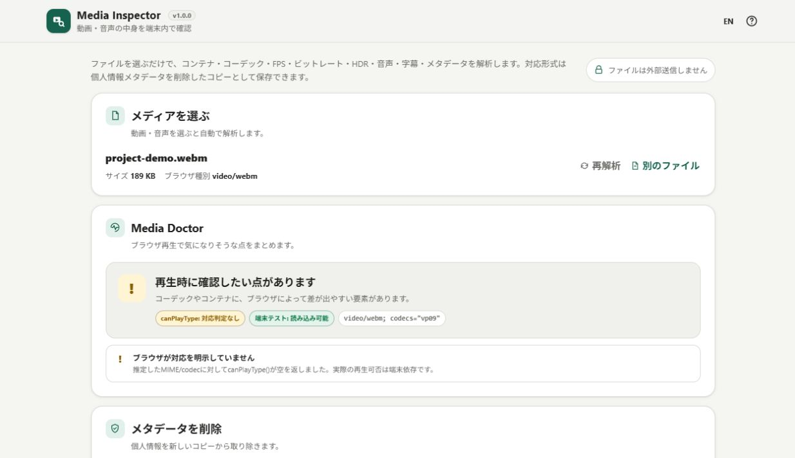

# Media Inspector

ヘッダーのバージョンは v1.0.1。プライバシーバッジは「完全ローカル処理」、言語ボタンは日本語表示中に EN、英語表示中に JA と表示します。切替先と言語に合ったヘルプの説明を表示します。

[](https://github.com/ttomohisa/htmlapps-media-inspector/actions/workflows/deploy-pages.yml)
[](LICENSE)
[](https://ttomohisa.github.io/htmlapps-media-inspector/)

[English README](README.md)

動画・音声ファイルをブラウザー内だけで解析し、コンテナ、コーデック、bitrate、fps、pixel format、HDR / 色情報、音声チャンネル、metadata、chapters、字幕、rotationなどを確認できる単一HTMLアプリです。選択したファイルを解析のためにサーバーへアップロードしません。

MP4 / MOV / M4V / M4A / MP3 / FLAC / WAVでは、**個人情報メタデータを削除した新しいコピーを保存**することもできます。映像・音声は再エンコードせず、元ファイルは変更しません。保存前には削除後ファイルを同じInspectorで自動再検査します。

さらに **Media Doctor** を搭載し、FFmpegの解析結果と「今このアプリを開いているブラウザー」の情報を組み合わせて、**「このファイルの中身は何か」**だけでなく、**「なぜこの動画はブラウザーで再生できない可能性があるのか」**も分かりやすく整理します。

## 🚀 デモ

### [GitHub PagesでMedia Inspectorを開く](https://ttomohisa.github.io/htmlapps-media-inspector/)

GitHub Pagesから最初のHTMLを読み込んだ後、選択したメディアの解析はHTML内に埋め込まれたFFmpeg 9 WebAssemblyで端末内処理されます。ファイル内容、metadata、生成された解析結果をアプリが外部へ送信することはありません。



## 主な機能

- 動画・音声ファイルをブラウザー内だけで解析
- コンテナ、ファイルサイズ、長さ、総bitrate、stream数、chapter数、probe scoreを表示
- 検出した Video / Audio / Subtitle / Data / Attachment などの全streamを表示
- Video：codec、FourCC/tag、profile、level、bitrate、解像度、FPS、pixel format、SAR、走査方式、rotation
- 色 / HDR：color range、primaries、transfer、color space、HDR分類、mastering display、MaxCLL / MaxFALL、Dolby Vision、HDR10+情報を取得できる範囲で表示
- Audio：codec、profile、bitrate、sample rate、channel数、channel layout、sample format、duration
- ファイル全体とstreamごとのmetadataを表示
- chapterのタイトル・開始時刻・終了時刻を表示
- Subtitleについて、取得できる場合はtext / bitmap種別も表示
- **Media Doctor** で現在のブラウザー向けの再生互換性ヒントを表示
- FFmpeg解析結果に `canPlayType()` とローカルの `<video>` / `<audio>` 読み込み結果を組み合わせて判定
- HEVC、AV1、特殊なコンテナ、HDR、rotation、弱いブラウザー対応シグナルなどを注意点として整理
- **メタデータを削除して保存**：MP4 / MOV / M4V / M4A / MP3 / FLAC / WAVに対応
- 撮影日時、位置情報、一般的な端末/ソフト情報タグ、タイトル、作者、コメント、カバー画像などのメタデータを映像・音声の再エンコードなしで削除
- 削除後ファイルを保存前に自動再検査し、個人情報候補が残る場合や再検査に失敗した場合は警告
- 保存ファイル名は編集可能。デフォルトは元ファイル名に `_metadata-cleaned` を付けた名前（例: `sample_metadata-cleaned.mp4`）
- 完全な解析結果をJSONとしてコピー
- 完全な解析結果を `.json` ファイルとして保存
- 解析結果がある状態で別ファイルへ切り替えるときは確認ダイアログを表示
- 日本語 / English 切り替え
- PC・スマートフォン向けレスポンシブUI
- スマホ下部に **ファイル / Doctor / Video / Audio / 詳細** の固定ナビ
- SVG faviconをHTML内に埋め込み
- WORKERFS入力により、選択ファイル全体をWASMメモリへコピーしない
- FFmpeg JavaScript / WebAssemblyをgzip圧縮して単一HTMLへ内包
- Content Security Policyで `connect-src 'none'`
- 通常版 `dist/index.html` と自己解凍版 `dist/index.self-extract.html` を生成

## すぐに使う

### Webで使う

[デモを開く](https://ttomohisa.github.io/htmlapps-media-inspector/)だけで利用できます。インストールやアカウント登録は不要です。

### 完全オフラインで使う（上級者向け）

1. このリポジトリをダウンロードまたはクローンします。
2. Windowsで `build-standalone.bat` を実行します。
3. 初回だけ、`dependencies.json` で固定されたFFmpeg WASM Builder v1.2.0のRelease assetを取得します。
4. Builderが公開している `SHA256SUMS.txt` と照合し、Release ZIPを検証してからHTMLへ内包します。
5. 生成された `dist/index.html` を任意の場所へコピーします。
6. 以降は、そのHTML単体をインターネット接続なしで直接開けます。

```powershell
.\build-standalone.bat
```

通常のWindowsビルドにPython、Node.js、ローカルWebサーバーは不要です。

解析の準備中や処理中もキャンセルできます。キャンセル後は、同じファイルの再解析や別ファイルへの切り替えができます。

## 使い方

1. 動画・音声ファイルを選択するか、ファイルエリアへドロップします。
2. Media Inspectorがブラウザーの `File` をWORKERFS経由でFFmpeg Workerへマウントし、自動で解析を開始します。
3. ブラウザーで再生できない理由を調べたい場合は、まず **Media Doctor** を確認します。
4. **基本情報** でコンテナ、時間、bitrate、stream数などを確認します。
5. **Video** / **Audio** カードでコーデックや映像・音声の詳細を確認します。
6. 字幕や追加streamがある場合は **字幕・その他** を確認します。
7. 個人情報を取り除いたコピーが必要なら **メタデータを削除して保存** を使います。元ファイルは変更されず、保存前に削除後ファイルを自動再検査します。
8. **詳細** ではmetadata、chapters、解析JSON、FFmpeg / runner / dependency情報を確認できます。
9. 必要なら **JSONをコピー** または **JSONを保存** します。

**基本情報** の **技術情報の要約を保存** で、コンテナ・形式・サイズ・長さ・ビットレートと、映像・音声・字幕・データ・添付の各ストリームをUTF-8の `.txt` に保存できます。項目名は選択中の言語になります。メタデータの値、チャプター名、本文中の元ファイル名、再生可否の判定は含みません。保存ファイル名は元の名前に基づくため、共有前に氏名などが含まれていないか確認してください。

コンテナ名には、ファイルの拡張子よりInspectorが検出した形式を使います。区別できない形式は **MP4 / MOV** や **Matroska / WebM** と併記し、不明な場合は `—` にします。

長さはミリ秒単位で丸め、分・時間の境界では繰り上げて表示します。取得できない長さは `—` になります。書き出すJSONの元の値は変更しません。

JSONのコピーには、クリック時点の解析結果を使います。コピー待ち中に解析結果が変わると、そのリクエストの代替コピー処理と通知を中止します。開始済みのブラウザーのクリップボード書き込みを取り消すことはできません。コピーに失敗した場合は **JSONを保存** を案内し、再試行もできます。

### 解析できる主な情報

| セクション | 主な内容 |
| --- | --- |
| **基本情報** | コンテナ、ファイルサイズ、時間、総bitrate、開始時刻、stream数、chapter数、probe score |
| **Video** | Codec、FourCC、profile、level、bitrate、解像度、FPS、pixel format、SAR、走査方式、rotation、色 / HDR情報 |
| **Audio** | Codec、profile、bitrate、sample rate、channels、channel layout、sample format、duration |
| **字幕・その他** | Subtitle、data、attachmentなどのstream情報とmetadata |
| **詳細** | ファイルmetadata、chapters、解析JSON、FFmpeg / runner / dependency情報 |

すべてのファイルにすべての情報が入っているわけではありません。元ファイルに記録されていない情報は、原則として無理に推定せず「不明」として扱います。例外として2ch音声のchannel layout補完については「制限事項」で説明しています。


## メタデータを削除して保存

削除保存は、解析専用のFFmpeg WASM runnerとは分離してブラウザーJavaScriptで行います。メタデータ領域を削除・無効化しながら `File.slice()` と `Blob` で新しいファイルを組み立てるため、映像・音声フレームをdecode / encodeし直しません。

| 形式 | 主な削除対象 | メディア本体 |
| --- | --- | --- |
| **MP4 / MOV / M4V / M4A** | movie / track / mediaの作成・更新日時、container `meta` / user-dataタグ、認識できるXMP系metadata | `mdat` と再生に必要なtrack / codec構造を保持 |
| **MP3** | 先頭ID3v2、末尾ID3v1 / APEv2 | 音声frame領域をそのままコピー |
| **FLAC** | Vorbis Comment、Picture metadata block | FLAC音声frameをそのままコピー |
| **WAV** | LIST/INFO、BEXT、iXML、AXML、XMP、ID3、CART、DISP、EXIFなどのRIFF metadata chunk | `data` chunkをそのままコピー |

削除後に生成したファイルは、保存前に同じFFmpeg Inspectorへもう一度渡します。個人情報らしいmetadataが見つかった場合は「完全に消えた」と扱わず警告し、ユーザーが明示的に選んだ場合だけ未検証扱いで保存できます。保存ファイル名は編集でき、デフォルトでは元ファイル名に `_metadata-cleaned` を付けます。元ファイル名自体に日時・氏名などが含まれる場合は、保存前に入力欄から変更できます。

**重要な範囲外:** chapterの内容、codec bitstream、専用のData / telemetry stream payloadは保持します。これらを安全に削除するには別のremux / stream書き換え処理が必要なため、chapter名、codec内部のencoder / 端末文字列、専用stream内のGPS・端末情報などが残る可能性があります。RF64の削除保存にも未対応です。UI上でもこの制限を表示し、元ファイル自体は一切変更しません。

## Media Doctor

Media Doctorは、単に `ffprobe` の結果をカード表示するだけの機能ではありません。解析結果を使って、**現在のブラウザーで再生しづらい理由を整理する**ための診断機能です。

次の3種類の情報を組み合わせます。

1. **FFmpeg解析結果** — コンテナ、codec、profile、HDR情報、rotationなどの技術情報。
2. **`canPlayType()`** — 推定したMIME type / codecの組み合わせについて、現在のブラウザーが返す対応シグナル。
3. **ローカルのmedia要素テスト** — 選択した `File` をBlob URLとしてローカルの `<video>` / `<audio>` へ渡し、metadataを読めるか、再生可能状態まで進めるかを確認。

Media Doctorの結果は**参考情報**であり、すべての環境に共通する絶対的な互換性判定ではありません。実際の再生可否は、ブラウザーのバージョン、OSのcodec、ハードウェア支援、端末性能、実際のbitstream内容などにも左右されます。

たとえば、次のような注意点を整理します。

- HEVC / H.265はブラウザーやOSの組み合わせによって利用できない場合がある
- AV1はブラウザーのバージョンやハードウェアによって対応状況が変わる
- HDR再生にはブラウザー、OS、GPU、ディスプレイ、transfer functionなど複数条件が関係する
- rotation metadataがあると、ファイル内の解像度と実際の表示方向が異なる場合がある
- FFmpegがコンテナを解析できても、そのブラウザーがネイティブ再生できるとは限らない

Media Doctorのためにファイルをアップロードしたり、裏で変換・修復したりすることはありません。

## 解析の仕組み

Media Inspectorはフル版のFFmpegコマンドラインをそのままWASM化していません。[FFmpeg WASM Builder](https://github.com/ttomohisa/htmlapps-ffmpeg-wasm-builder) v1.2.0の専用 `media-inspector` coreを使用します。

1. ブラウザーの `File` をEmscripten WORKERFSでWorkerへマウント
2. 軽量なFFmpeg runnerがコンテナを開き、stream情報を解析
3. `libavformat` / `libavcodec` / `libavutil` の公開APIから、format、codec、時間、metadata、chapters、色、HDR、rotation、channel layoutなどを取得
4. 解析coreにはframe decoder、encoder、filter、swscale、swresampleを入れない
5. MEMFSへ書き出すのは小さな構造化JSONレポートだけ
6. ブラウザー側がJSONを読みやすいカードUIへ変換
7. Media Doctorが現在のブラウザー固有の互換性情報を追加表示
8. 削除保存を選んだ場合は、ブラウザー側で `File.slice()` / `Blob` を使って新しいコピーを構成し、保存前に同じWASM runnerで再検査

入力ファイルはWORKERFSでマウントするため、WASMへ渡す目的だけで選択ファイル全体に `File.arrayBuffer()` を実行してMEMFSへコピーする構成にはしていません。

## GitHub Pagesで公開する

このリポジトリには、完全内包版をビルドしてGitHub Pagesへ自動公開するworkflowが含まれています。

1. `htmlapps-media-inspector` としてGitHubへpushします。
2. **Settings → Pages → Build and deployment → Source** で **GitHub Actions** を選択します。
3. `main` へpushするか、Actions画面からデプロイworkflowを手動実行します。
4. ビルド成功後、`https://ttomohisa.github.io/htmlapps-media-inspector/` で公開されます。

Pagesがまだ有効化されていない場合、workflowはstandalone HTMLのビルドと検証を行ったうえで、デプロイだけをスキップします。SettingsでGitHub ActionsをPagesのSourceに設定した後、workflowを再実行してください。

`main` へのpush時には、固定されたFFmpeg Release assetからstandalone HTMLを再生成し、repository checkを通したあと、build artifactを保存して `dist/` をPagesへ公開します。

## 開発とビルド

```text
.
├─ src/index.template.html            # アプリ本体のテンプレート
├─ app.config.json                    # アプリ名・バージョン・出力設定
├─ dependencies.json                  # 固定したFFmpeg WASM Builder Release
├─ build-standalone.bat               # Windows用ビルド入口
├─ build-standalone.ps1               # 単一HTML生成処理
├─ components/
│  ├─ confirm-dialog.html             # 再利用用の確認ダイアログ
│  └─ mobile-bottom-bar.html          # 再利用用のスマホ下部バー
├─ scripts/
│  ├─ check-repository.ps1            # リポジトリ全体のビルド検証
│  ├─ verify-standalone.ps1           # 通常版HTMLの検証
│  ├─ build-self-extract.ps1          # gzip自己解凍HTMLの生成
│  └─ verify-self-extract.ps1         # 自己解凍版の検証
├─ dist/
│  ├─ index.html                      # ビルド後の通常版
│  ├─ index.self-extract.html         # gzip自己解凍版
│  └─ dependency-manifest.json        # 検証済み依存関係情報
├─ media-inspector.html               # dist/index.htmlと同期する配布用HTML
└─ .github/workflows/
   ├─ build-standalone.yml            # Pull Request時のビルド検証
   └─ deploy-pages.yml                # mainからPagesへ自動公開
```

生成済みHTMLを直接編集せず、`src/index.template.html` を変更して再ビルドしてください。

### FFmpeg依存を更新する

現在は `dependencies.json` でFFmpeg WASM Builder v1.2.0の `media-inspector` Release assetを固定しています。

バージョンを変更したら再ビルドします。キャッシュを破棄してReleaseを取り直す場合：

```powershell
.\build-standalone.bat -ForceDownload
```

ビルド処理は以下を自動で行います。

- 固定したBuilder Releaseから `SHA256SUMS.txt` を取得
- `ffmpeg-wasm-media-inspector-v1.2.0.zip` を取得
- Release ZIPのSHA-256を照合してから使用
- 対応するsource archiveが同じchecksum一覧に含まれていることを確認
- `ffmpeg.js.gz` と `ffmpeg.wasm.gz` を単一HTMLへ内包
- Release情報、binary archive hash、source archive hash、source URLを `dist/dependency-manifest.json` に記録
- 外部runtime script / stylesheet / frame / CSS URL / module importが残っていないことを検証
- `connect-src 'none'` を検証
- `media-inspector.html` をリポジトリ直下の配布用コピーとして生成
- `dist/index.self-extract.html` を生成
- 自己解凍版が通常版HTMLへバイト単位で復元できることを検証

## プライバシーと通信防止

生成HTMLは、解析時に外部サーバーを必要としない構成です。

- Content Security Policyに `connect-src 'none'`
- FFmpeg JavaScript / WebAssemblyはHTML内に埋め込み
- gzip assetは `DecompressionStream` で端末内展開
- 選択したメディアはWORKERFSでローカルにマウント
- Media Doctorはブラウザー内APIとローカルBlob URLだけを使用
- 解析JSONは、ユーザーが明示的にコピー・保存しない限りブラウザー内に留まる
- メタデータ削除後のファイルも端末内だけで組み立て、ユーザーが保存を選んだときだけダウンロードする
- analytics、telemetry、login、cloud storage、remote fontは使用しない

GitHub Pages版では最初のHTMLを取得する通信は発生しますが、選択した動画・音声や解析結果をアプリが外部へ送信することはありません。

完全にネットワークを切って使う場合は、生成された `dist/index.html` をローカルで直接開いてください。

## 制限事項

- 解析できる形式は、FFmpeg WASM Builderの `media-inspector` profileで有効化しているdemuxer / parserの範囲に限られます。
- 破損ファイル、暗号化ファイル、未対応コンテナは開けない場合があります。
- 元のcontainer / streamに保存されていない情報は取得できません。
- 解析coreにはframe decoderを入れていないため、フレームを完全にdecodeしないと分からない情報は対象外です。
- ファイルが明示的なchannel layoutを持たず「2 channels」だけを報告する場合、表示用にFFmpegの標準的な `stereo` layoutを補完することがあります。JSONでは `channelLayoutInferred: true` として推定値であることを記録し、元の報告値も別に保持します。
- Media Doctorは現在アプリを開いているブラウザー / 端末向けの診断であり、他環境を含む絶対的な再生保証ではありません。
- ブラウザー、OS、ハードウェア側の更新によって、同じファイルでも将来の再生可否が変わる可能性があります。
- メタデータ削除保存は MP4 / MOV / M4V / M4A / MP3 / FLAC / WAVに限定し、それ以外は解析のみです。
- chapterの内容、codec bitstream、専用Data / telemetry stream payloadは保持するため、chapter名やGPS・端末固有情報が残る場合があります。
- RF64のメタデータ削除保存には対応していません。
- ファイル修復、codecのtranscode、音量調整、元ファイルの上書きは行いません。
- 通常版HTMLでは `DecompressionStream('gzip')` を使用するため、現在のChrome / Edge / Firefox / Safariを推奨します。

## 使用コンポーネント

| コンポーネント | バージョン | ライセンス | 用途 |
| --- | ---: | --- | --- |
| FFmpeg WASM Builder `media-inspector` core | 1.2.0 | 生成core: LGPL-2.1-or-later | ローカルのcontainer / stream解析 |

アプリ本体のソースと、埋め込まれるFFmpeg生成coreは別ライセンスです。再配布条件、対応source archive、依存関係の詳細は [THIRD_PARTY_NOTICES.md](THIRD_PARTY_NOTICES.md) を確認してください。

## コントリビューション

バグ報告や機能提案はGitHub Issuesからお願いします。開発方法は [CONTRIBUTING.md](CONTRIBUTING.md) を確認してください。

## ライセンス

Copyright © 2026 ttomohisa

アプリ本体は [MIT License](LICENSE) です。埋め込まれるFFmpeg生成coreは別のLGPL条件で配布されます。詳細は [THIRD_PARTY_NOTICES.md](THIRD_PARTY_NOTICES.md) を確認してください。

### 解析レポートの回帰テスト

リポジトリの検証にはPowerShellに加えてNode.js 20以上が必要です。`scripts/test-report-exports.cjs` をソース、読みやすい配布版、ルート配布版、自己展開版の展開後HTMLに対して実行します。ソースのみの確認は `node scripts/test-report-exports.cjs` で実行できます。技術情報のテキスト保存、ファイル名、欠損値とゼロ、メタデータ除外、結果の有効期間、検出形式によるコンテナ表示も検証します。ブラウザー・クリップボード・ダウンロード・メディア解析部分はテスト用に置き換えているため、実際のクリップボード、ブラウザーのフォーカス、実メディアは別途ブラウザーでの検証が必要です。
